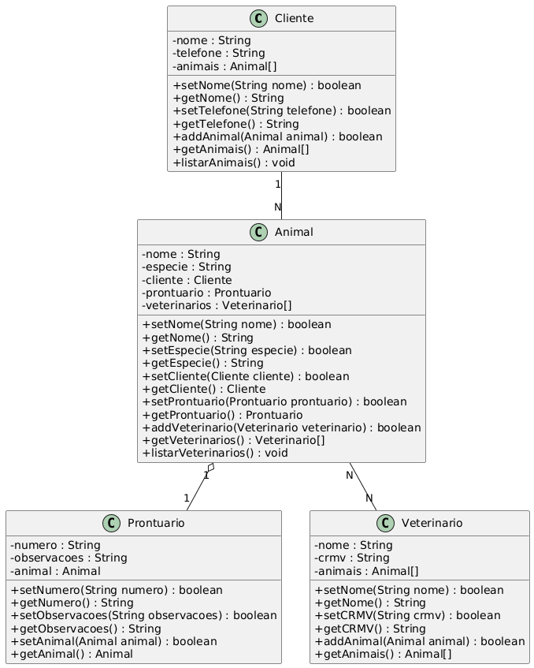

# 📚 Exercício de Fixação 07 – Relacionamentos entre Classes

## 🎯 Contexto

Uma clínica veterinária está desenvolvendo um sistema para informatizar o cadastro de seus clientes, animais de estimação, prontuários e médicos veterinários.

Cada cliente pode possuir vários animais cadastrados. Cada animal possui um prontuário exclusivo contendo seu histórico de atendimento. Durante sua vida, um animal poderá ser atendido por diferentes médicos veterinários, assim como um veterinário poderá atender diversos animais.

Analise a imagem a seguir e observe os relacionamentos existentes entre as entidades do sistema.



> **Figura 1 – Diagrama UML das classes propostas como exercício.**

A partir desse cenário (Figura 1), implemente as classes e os relacionamentos necessários utilizando os conceitos de Programação Orientada a Objetos estudados neste documento.

---

## 🔎 Análise do Cenário

Antes de iniciar a implementação, observe atentamente a figura e identifique os relacionamentos existentes.

Você deverá perceber que:

- um **Cliente** pode possuir vários **Animais**;
- cada **Animal** pertence a um único **Cliente**;
- cada **Animal** possui exatamente um **Prontuário**;
- cada **Prontuário** pertence a um único **Animal**;
- um **Veterinário** pode atender vários **Animais**;
- um mesmo **Animal** pode ser atendido por diferentes **Veterinários**.

Durante a implementação, todos esses relacionamentos deverão ser representados utilizando objetos, composição e referências cruzadas.

---

## 📖 Conteúdos Trabalhados

Este exercício aborda os seguintes conceitos:

- Classes e Objetos;
- Encapsulamento;
- Modularização;
- Composição;
- Relacionamentos entre Classes;
- Relacionamento **1:1**;
- Relacionamento **1:N**;
- Relacionamento **N:N**;
- Validação utilizando `instanceof`;
- Referências cruzadas entre objetos.

---

## 🎯 Objetivos

Ao concluir este exercício, você deverá ser capaz de:

- modelar classes utilizando Programação Orientada a Objetos;
- implementar relacionamentos entre objetos;
- utilizar composição para representar associações entre classes;
- validar objetos utilizando o operador `instanceof`;
- implementar referências cruzadas entre objetos relacionados;
- organizar aplicações JavaScript utilizando módulos.

---

## 📁 Estrutura do Projeto

Organize sua solução conforme a estrutura abaixo.

```text
objetos/

    Cliente.js
    Animal.js
    Prontuario.js
    Veterinario.js

usaClinica.js
```

---

# Parte 1 – Classe Cliente

Crie uma classe chamada **Cliente**.

Ela deverá possuir os seguintes atributos privados:

- nome
- telefone
- animais

O atributo `animais` deverá ser um vetor de objetos da classe `Animal`.

Implemente:

- métodos getters;
- métodos setters;
- método `addAnimal()`.

O método `addAnimal()` deverá:

- aceitar somente objetos da classe `Animal`;
- validar o objeto utilizando `instanceof`;
- adicionar o animal ao vetor;
- criar automaticamente a referência cruzada entre Cliente e Animal.

---

# Parte 2 – Classe Animal

Crie uma classe chamada **Animal**.

Ela deverá possuir os seguintes atributos privados:

- nome;
- especie;
- cliente;
- prontuario;
- veterinarios.

O atributo `veterinarios` deverá ser um vetor de objetos.

Implemente os métodos necessários para:

- associar um cliente;
- associar um prontuário;
- adicionar veterinários;
- recuperar todas as informações cadastradas.

Todos os relacionamentos deverão validar os objetos utilizando `instanceof`.

---

# Parte 3 – Classe Prontuario

Crie uma classe chamada **Prontuario**.

Ela deverá possuir os atributos privados:

- numero;
- observacoes;
- animal.

Cada prontuário pertence a exatamente um animal.

Implemente:

- getters;
- setters;
- método para associar um Animal;
- método para recuperar o Animal associado.

O relacionamento deverá ser do tipo **1:1**.

---

# Parte 4 – Classe Veterinario

Crie uma classe chamada **Veterinario**.

Ela deverá possuir os atributos privados:

- nome;
- crmv;
- animais.

O atributo `animais` deverá ser um vetor.

Implemente:

- getters;
- setters;
- método `addAnimal()`;
- método `getAnimais()`.

Ao adicionar um animal, a referência cruzada deverá ser criada automaticamente.

---

# Parte 5 – Integração das Classes

Crie um arquivo chamado:

```text
usaClinica.js
```

Nesse arquivo você deverá:

1. criar um cliente;
2. criar dois animais;
3. criar um prontuário para cada animal;
4. criar dois veterinários;
5. estabelecer todos os relacionamentos entre os objetos;
6. imprimir as informações utilizando `console.log()`.

Ao final da execução deverão ser exibidos:

- nome do cliente;
- telefone;
- animais cadastrados;
- prontuário de cada animal;
- veterinários responsáveis por cada animal;
- referências cruzadas.

---

## 🧪 Testes Esperados

Verifique se sua aplicação atende aos seguintes requisitos:

- um cliente pode possuir vários animais;
- cada animal pertence a um único cliente;
- cada animal possui um único prontuário;
- cada prontuário pertence a um único animal;
- um veterinário atende vários animais;
- um animal pode possuir vários veterinários;
- todos os relacionamentos possuem referências cruzadas funcionando corretamente.

---

## ⭐ Desafio

Implemente os seguintes métodos.

Na classe **Cliente**:

```javascript
listarAnimais()
```

Esse método deverá exibir uma saída semelhante a:

```text
Cliente: João Silva

Animais:

• Rex
• Luna
• Mel
```

Na classe **Animal**, implemente:

```javascript
listarVeterinarios()
```

Exibindo todos os veterinários responsáveis pelo atendimento do animal.

---

## 📝 Questões Teóricas

Responda às questões a seguir.

1. Qual a diferença entre um relacionamento **1:1** e um relacionamento **1:N**?

2. Em quais situações utilizamos um relacionamento **N:N**?

3. Qual a finalidade do operador `instanceof` neste exercício?

4. O que são referências cruzadas entre objetos?

5. Qual a vantagem de organizar cada classe em um arquivo separado?

6. Qual a diferença entre herança e composição?

7. Em qual relacionamento do exercício foi utilizada a composição?

8. Explique como os relacionamentos implementados tornam o sistema mais próximo da realidade.

---

## 📌 Critérios de Avaliação

| Critério | Pontuação |
|----------|:---------:|
| Encapsulamento | 1,0 |
| Relacionamento 1:N | 1,5 |
| Relacionamento 1:1 | 1,5 |
| Relacionamento N:N | 1,5 |
| Validação com `instanceof` | 1,0 |
| Referências cruzadas | 1,0 |
| Organização do código | 1,0 |
| Integração da aplicação | 1,5 |

**Total: 10,0 pontos**

---

## 💡 Dicas

- Desenvolva uma classe por vez.
- Teste cada relacionamento antes de implementar o próximo.
- Utilize apenas os métodos públicos para acessar os atributos dos objetos.
- Evite acessar atributos privados diretamente.
- Mantenha uma organização semelhante à utilizada ao longo deste capítulo.
- Sempre valide os objetos recebidos utilizando o operador `instanceof`.
- Teste frequentemente sua aplicação utilizando o arquivo `usaClinica.js`.